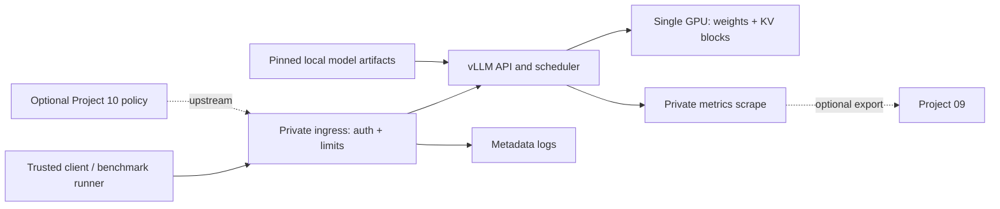

# High-level design

Status: PROPOSED. Read evaluation strategy before accepting LLD.

Ingress is the only client-facing surface. vLLM binds privately; health, metrics and administrative surfaces stay on the management network. An API key alone is not treated as comprehensive endpoint protection. Native serving owns tokenization, continuous batching, sampling and GPU execution; do not recreate its scheduler. Initial deployment has one failure domain and planned downtime for profile/model changes.

The model artifact directory is read-only to serving where practical; downloads occur during provisioning with approved sources/revisions. No remote-code execution unless separately reviewed. Runtime content remains in process/GPU memory; application prompt and completion persistence is disabled. Metadata includes request status, duration, token counts and profile identifier. Benchmarks store synthetic workload IDs, not user prompts.

A deployment profile describes the immutable image/model/tokenizer revisions and the tunable context, concurrency, memory and cache settings. Baseline, cache and quantized profiles are separate evidence-bearing candidates; promotion requires tests and quality gates. Keep one verified rollback profile and its artifacts. No database, custom cache service or orchestration control plane is needed.

The service starts through provisioning -> loading -> ready -> draining -> stopped, with failed from any startup state. Readiness represents the ability to serve the configured model, not merely an open port. Once draining, ingress rejects new work and waits a bounded interval for active streams. No automatic request replay after partial output because it may duplicate content.

Failure policy: reject overflow, fail closed on authentication/validation errors, mark worker failures unavailable, recover under a bounded supervisor policy, and do not retry indefinitely. Telemetry failure must not block serving; exporter buffers and dropped-event counters are bounded.

Trust assumptions: trusted operator and host, authenticated clients, no cross-tenant isolation promise. If future callers have different trust levels, isolate serving processes or reassess verified cache-salting support and timing risks before sharing cache. See [security](../operations/security.md) and [sources](../sources.md).
