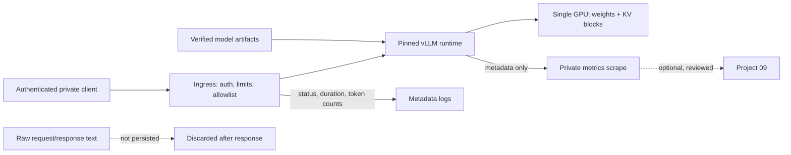

# Threat model

Status: PROPOSED_FOR_REVIEW. Author: implementing agent; not self-approved. Boundary claims below must not be cited as verified until the reviewer accepts them and the enforcing phase has passed a check. Complements [HLD](HLD.md) and [security operations](../operations/security.md).

## 1. Protected assets

- integrity of the pinned image, model weights, tokenizer, chat template and profile definitions;
- confidentiality of prompts, completions and any credential or API key;
- integrity of benchmark inputs, raw records and reported results, including the honest distinction between measured and unmeasured claims;
- availability of the single GPU host and the private service for its declared envelope;
- the private network boundary: no unauthenticated ingress, no public exposure, no undisclosed egress;
- the operator's host: no code execution or filesystem reach beyond the serving process's intended scope.

## 2. Trust boundaries

Authenticated private clients are untrusted beyond their credential and declared envelope: message content, request length and requested parameters are all attacker-controlled. The pinned runtime, image digest, model artifact and host are trusted only after revision/hash verification; a model artifact is untrusted input until then. The operator and root are trusted and are explicitly out of scope for adversarial isolation. Management, metrics, health and administrative surfaces are trusted-network only and are not protected by client credentials. Project 09/10 integrations are outside the boundary and optional. Model output content is never a trust decision: serving controls do not make generated text safe.

## 3. Threats and controls

| Threat | Example | Required controls | Verification |
|---|---|---|---|
| Unauthenticated or public exposure | ingress port reachable beyond the private network; management route on the client path | bind ingress privately, explicit endpoint allowlist, management network separation; API key is not endpoint protection | external reachability probe; unauthenticated request matrix |
| Credential theft | key in profile file, logs, error body or URL | external secrets, no inline secrets in profiles, redaction before sinks, key scoped to client surface only | log/error/artifact scan for canary |
| Prompt or completion leakage | prompt text in logs, metrics labels, traces or benchmark records | metadata-only telemetry, no raw request/response persistence, no prompts as metric labels | telemetry leakage audit with distinct canaries |
| Resource exhaustion / OOM | oversized context, many concurrent requests, unbounded queue, long generation | body ≤128 KiB, combined token budget ≤4,096, `n=1`, bounded concurrency, bounded queue with admission deadline, reject overflow explicitly | limit, saturation and overload probes; queue-bound proof |
| Prefix-cache cross-request exposure | one client's prefix reused or timing-observable for another | single trusted operator domain in V1; no cross-tenant promise; reassess verified cache-salt support and timing risk before any multi-trust deployment | cache privacy review before expanding trust levels |
| Management-surface abuse | metrics or admin route exposed, or used to infer workload | keep management routes off the client surface, deny by default, no payload in metrics | management route denial test |
| Artifact supply chain | tampered weights, moving tag, unpinned image, silent pull | immutable image digests and model/tokenizer revisions, approved sources, read-only model mounts, license review before download | manifest review; digest/revision equality check |
| Remote code execution via model artifact | `trust_remote_code` or custom kernel loading | avoid remote code; if unavoidable, separate review and recorded exception before execution | config review; exception record |
| Silent paid fallback / egress | provider API called on local failure; undisclosed outbound traffic | no provider fallback in configuration; restricted egress; dependency review | restricted-egress test; attempted-failure egress capture |
| Host compromise from the serving process | container escape, over-broad mounts, root runtime | non-root runtime where supported, least filesystem access, no unnecessary host mounts | mount and privilege review |
| Disk exhaustion | repeated artifact pulls, unbounded raw-record retention | declared download budget, pinning, default 30-day raw-record retention with named cleanup | disk-usage check during soak |
| Measurement integrity | unmeasured or partial runs presented as results; failed requests dropped from latency; single trial reported as causal | declare cache state, fixed workload, repeated trials, randomized order, report failures and uncertainty, keep raw evidence bound to a run id | report completeness review against the evidence manifest |
| Adversarial or unsafe model output | prompt injection, harmful content, fabricated facts | declared as out of scope for serving controls; safety is a content concern, not an ingress control; no claim of autonomous protection | do not claim safety; document limitation |
| Unsupported-feature overclaiming | KV quantization or a metric implied as working without a compatibility record | explicit unsupported outcome is an accepted result | compatibility record or explicit unsupported note |

## 4. Request and telemetry data flow

Prompt and completion text exists only in process/GPU memory for the duration of a request. Logs, metrics and benchmark records carry identifiers, status, timing, token counts and profile only. Benchmark records store synthetic workload identifiers, not user prompts.

## 5. Abuse cases that must block release

- any unauthenticated or publicly reachable inference route;
- a prompt, completion or credential canary appearing in logs, metrics, artifacts or the published manifest;
- an undisclosed outbound provider call, or any paid inference path, on a request path;
- reported results not traceable to a run id, environment manifest and raw evidence;
- a latency or memory claim whose failed or dropped requests were excluded without being reported;
- an optimization profile promoted without the quality gate having been met.

## 6. Residual risk

The single GPU host is one failure domain with planned downtime; this is not HA. Native API keys do not protect management surfaces on their own. Prefix-cache sharing is acceptable only under one trusted operator domain — timing and salt behavior must be reassessed before any multi-trust deployment. Quantization and quantization-adjacent backends carry compatibility and quality risk that a passing benchmark does not eliminate. Generated content may be false, unsafe or injected against; serving controls bound resources and access, not truthfulness. Host root and physical access are out of scope. Published evidence reduces, but cannot eliminate, the risk that a reader generalizes one model/GPU/workload result beyond what was measured.
