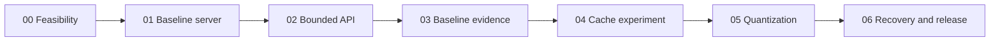

# Phase dependency map

Each arrow means predecessor COMPLETE plus review approval, not merely files present. Evaluation protocol is reviewed before accepting the LLD and frozen in Phase 03 before optimization. Optional KV experiment in Phase 05 can be recorded unsupported without blocking a supported weight experiment and release. A failed quality candidate falls back to the baseline; negative experimental evidence is valuable.

No hard dependency on Projects 09 or 10. Optional telemetry and guardrail adapters are later scope with their own review, not hidden prerequisites. Project 11 consumes sanitized evidence after release; Project 12 links that evidence or a recorded demo. Neither requires publicly exposing the GPU host.

The full Project 12 all-live target needs actual reviewed live P08 access; a recording is a fallback and must be labeled as such. Keep inference private by default. A later authenticated, rate-/budget-bounded access design and explicit exposure approval are required before claiming P08 live-demo coverage.
